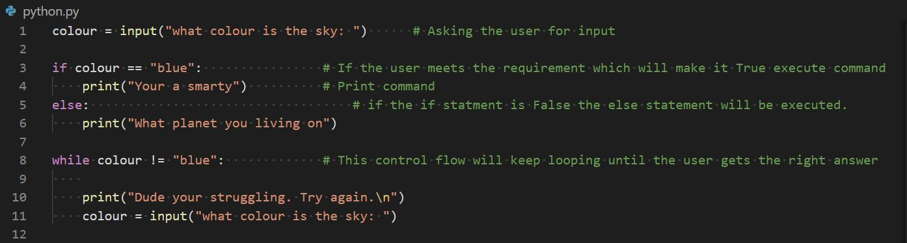
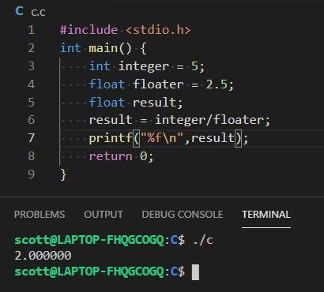
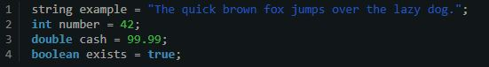
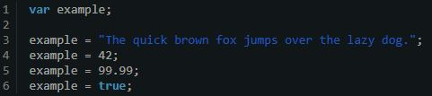
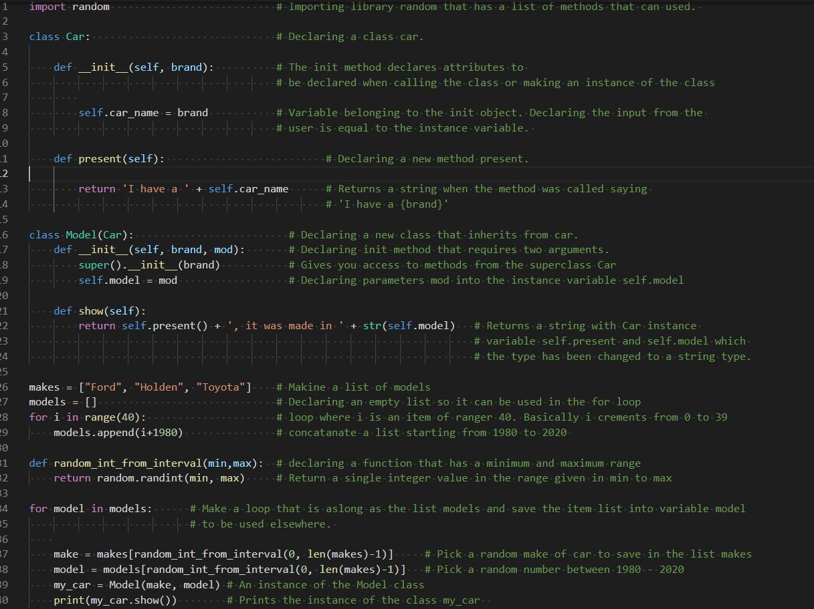

# T4A1 - Developer Workbook

### Q1) Provide an overview and description of a standard source control process for a large project.

A standard source control in linux is git. Can be used in conjuction with Github which is an online free repository. Git is used to make multiple save points of a project named commits. These commits will have saved the program as a version of that program at that time. Furthermore it will save the developers description of the version, normally where their upto in the project, dates and commit identification numbers. Commits do not over write each other so a developer can go to an old commit and retrieve the exact version the code was set in at the time. The developer then has an option to reset back to that setting if required or checkout a branch to work in and make changes without the master branch being effected. The branch will then need to be merged back into the master branch. Git will automatically merge unless there are changes that conflict in both sequences. A vim file will be created and the developer will have to manually select what to merger and what to diregard. It is good work practice to store the repositories on another platform so there are multiple copies. It is possible to SSH into Github repositories where you can push versions really easily to be stored online.

Github is an excellent tool to be used in large projects because github assists in development operations when multiple developers are working together. Github has process's to assist companies to work together online. Starting on a project Github allows developers to fork a repository where they clone the repository into their own repository. Once changes are made they can push the code back to the original developer where it will need to be approved before merging. This is known as a pull request. Using Github it would be ideal to set up a workflow of continuous integration and continuous deployment for large projects. Github has an actions tab where a system can be automatically deployed if it meets all requirements. The requirements should have some process of testing the code. It might still only be deployed if it is on the master branch which allows for the senior developer to overlook it first. 

So git and Github combined allow developers to work together on the same projects but in parallel of each other where their changes will not impact each other until approved and tested. The continous integration and continious deployment allows other developers to recieve to updated code in real time where they should not be impacted. 

### Q2) What are the most important aspects of quality software?
### Q3) Outline a standard high level structure for a full-stack application and explain the components

A standard high level structure we have worked with is the MVC architecture. MVC is an abbreviation of Model, View and Controller. Model represents the components of a database such as tables and its fields. Once a database has been created the model can then interact directly with the database. The Controller will direct the information stored in the database and the user inputs. It can take imput from the user and determine an action. The controller will take the information from the database and direct it towards the View component before being displayed to clients or users. The View component transforms the data into an aesthetically pleasing display.

The MVC pattern is an advantage used in large projects because it allows adding components and maintaining the program to be accomplished with ease due its seperation of the input, processing and the output. That has many advantages such as:

- Faster Development Process: Multiple developers can work in parallel to achieve a goal. Merging data is simplified.
- Ability to provide multiple views: Can create templates of html and implement with ease.
- Support for asynchronous technique: Use across multiple platforms.
- The modification does not affect the entire model: Easy to update and maintain.
- MVC model returns the data without formatting: Meaning the data can be formatted by different languages

https://www.brainvire.com/six-benefits-of-using-mvc-model-for-effective-web-application-development/

### Q4) A team is about to engage in a project, developing a website for a small business. What knowledge and skills would they need in order to develop the project?

What they need compared to what they should be capable of are different. Developers could design a website with pythons bare minimum requirements. That means not following MVC architecture. Not using the flask framework. They could use raw sql queries which may be a security issue. Below are the basic ideas to what they need.

- They will need to have an ability to design the website. Normally the role of a UX/UI designer. A UX/UI designer should gain a full understanding of the requirements of the small business. The team should atleast have a decent understanding of wireframes and database design using computer aided programs such as lucid chart. I suppose they could draw ERD's free hand if they wanted too. Would not recommend.

- I assume that they will need a database to atleast handle employee and pay. So some knowledge of SQL and some knowledge in designing database's. They will need to understand how connect the database to a server using python or other native languages. Possibly downloading and importing psycopg2 into python. Raw SQL would be used which may be at risk of sql injection.

- They will need to understand a native backend language to implement the computing and components to have a running website. Possibly python or JAVA. 

- They will need to build a GUI so user's can communicate with the website and the website is aesthically pleasing for potential customers. This means they may need an understanding of HTML and CSS. 

- They will need to understand and implement cyber security. This is Authorisation and Authentification principles to protect the data on the website.

- They need to have a good understanding of HTTP protocals and requests. Each endpoint will need to send a request to retrieve the data necessary.

- They will need to set up a web server either locally or on the cloud so users can gain access to the website.  

### Q5) With reference to one of your own projects, discuss what knowledge or skills were required to complete your project, and to overcome challenges.

### Q6) With reference to one of your own projects, evaluate how effective your knowledge and skills were for this project, and suggest changes or improvements for future projects of a similar nature.

### Q7) Explain control flow, using an example from a suitable programming language.

In functional programming most programs follow a sequential control flow. That means they read from top to bottom. In saying that there are programs such as VHDL that can execute commands in parallel. For a program to execute in parallel it first will require multiple core processing where each core executes a command. Generally left to right, top to bottom is the norm. Executing left to right is not always the case either. Mathematical functions will often execute multiplication and divison before adding subtracting but generally left to right, top to bottom is the way to go. When executing commands in a control flow it is possible to direct the flow through if, elif or else statements or/and loops. If, elif and else statements follow boolean logic. Either they are True or False. If true the flow will execute the command in the if statements. If False the command will be passed which means ignored. Similar to if statements, loops work on boolean logic as well where a statement needs to meet a True or False requirement to change the status of the loop. Moreover a range could be given to control how many times the program loops.

### Q8) explain type coercion, using examples from a suitable programming language.

Type coercian is when one object is transformed into another object implicitly. This is different to type conversion that is done explicitly through type casting aka type defining. Many platforms may handle type coercian differently. For data type coercion to happen there needs to be a coerce built-in function built into the data type. 

The most common type coercian across most platforms would be when dividing an integer by a float or vice versa as given in the example below. Both variables are stored as different objects yet the program can still complete the mathimatical equation. It does it implicitly. Depending on the result variable and how it is declared will determine if the answer will be an int or a float. Type coercian happens all the time and it can be as simple as declaring a float and given an int argument, for example float number = 5. The number 5 of type int is converted to type float implicitly. Another example could be double result = 5 + 6.3. The user is adding an int and a float type. Other languages such as Javascript can covert integers to strings, for example var val = '10' + 10 will result in val = 1010.

2021. [online] Available at: <http://faculty.salina.k-state.edu/tmertz/Java/041datatypesandoperators/07typecoercionandconversion.pdf https://www.freecodecamp.org/news/js-type-coercion-explained-27ba3d9a2839/> [Accessed 18 January 2021].

McFarlin, T., 2021. The Beginner's Guide To Type Coercion: What Is Coercion?. [online] Code Envato Tuts+. Available at: <https://code.tutsplus.com/articles/the-beginners-guide-to-type-coercion-what-is-coercion--cms-21917> [Accessed 18 January 2021].

### Q9) Explain data types, using examples from a suitable programming language.

Data types in programming occur so a compiler or an interpreter can put aside memory to allocate to a variable for storage. In small electronic devices like stop watches, apple watches, bluetooth headphones or other small devices memory can be very restricted so declaring the data types into variables may reduce the size of memory required.  

##### The common different data types are:

| Data Type | Memory Allocation |
|---|---|
| Integer | 4 bytes |
| Floating-point | 4 bytes |
| Double | 8 bytes |
| Character | 1 bytes | 
| Boolean | 1 bit |
| String | character*length of string |

Each data type has its own set of rules and instructions for manipulation. For example, take an integer and plus it with another integer. The computer will look up the function in the int data type to add two integers together. If a user tried to add a string data type and an int data type the computer will not know how to compute that with exception to certain languages. 

There are strongly typed languages and then there are dynamically typed languages. Strongly typed languages all require a declaration of a variable before using the variable to store information. So the program can allocate the required space in memory. Below is an example of declaring variable in a strongly typed language.

Dynamically typed languages have a variable that can be of any data type depending on what it is assigned to. I assume Python use's a dynamically typed language.

Declaring data types also has security principles. When declaring variables you are restricting what type of data can be stored into that variable. When accepting data from a user it is an advantage to restrict what data can be taken into the program. Data types define the operations that can be done on the data, the meaning of the data, and the way values of that type can be stored therefore restricting vulnerabilities such as buffer overflows or internal commands such as SQL injection. 

En.wikipedia.org. 2021. Data Type. [online] Available at: <https://en.wikipedia.org/wiki/Data_type#:~:text=In%20computer%20science%20and%20computer,intends%20to%20use%20the%20data.&text=This%20data%20type%20defines%20the,that%20type%20can%20be%20stored.> [Accessed 18 January 2021].

### Q10) Explain how arrays can be manipulated, using examples from a suitable programming language.

In strong typed languages such as c language they have a concept called pointers. Pointers are an object that stores an address of a variable and when called with a certain syntax it can display the contents where the pointer is pointing. In that same context arrays are just a list of grouped pointers that point to the location of the contents. Each pointer in the array is labelled  with an index number which increments starting from 0 to infinty. To access the contents of the array you will need to call the name of the array and insert an index number to the location of the data required. Array indices always start at 0. Example below:

##### Syntax in C language.

    chocolate[0] = "mars bar"
    
    >> printf("%s",chocolate[0])
    mars bar

It is common in strong typed languages that the user will need to to declare the data type of the content going into the variable and the length of the array. It is common that a security vulnerability of a buffer overflow is taken advantage of if security protocals are not inforced. This is when users or hackers input data into the array indices greater then what has been initialised. 

    int data[100] = {0,1,2,3,3,4,45,324234234234};      # Initialising an empty array that only excepts type int 
    
    >> printf("%d",data[0]);           # Displays the integer value stored at index 0 in the data array  
    0
    >> printf("%d",data[6]);           # Displays the integer value stored at index 6 in the data array
    45

Often arrays will need to be accessed incrementally. To access the array and add data where required it is often useful to use a loop. Either a for loop could be used if the length of the array is known or a while loop. A variable counter will need to be initialised and increment through the index. Example below:
    
    int i;
    int data[100];

    for (i=0;i<100;i++)  # Initialise i the increment by one until i = 99
    {   
        data[i] = i+1
        printf("%d",data[i]) # Will display the contents stored at data[i];
    }
    
    int = 0;
    while i != 99;  # Will do the same thing as the for loop. While loops are good for user input.
    {
        printf("%d",data[i]) # Will display the contents stored at data[i];
        i++;
    }

As the program gets more advanced you can start to think about dynamic memory allocation. Dynamic memory allocation for arrays will change the length of the arrays during runtime. This is particularly advantagis when minimising disk space for small hardware such as apple watches or any small electronics. 

### Q11) Explain how objects can be manipulated, using examples from a suitable programming language

class and objects are linked. Classes are a blueprint. Objects then become a design made from the blueprint. An object will hold specific information in the structure that the class is. Objects inherit everything from the class.  

### Q12) Explain how JSON can be manipulated, using examples from a suitable programming language
### Q13) For the code snippet provided below, write comments for each line of code to explain its functionality. In your comments you must demonstrates your ability to recognise and identify functions, ranges and classes

